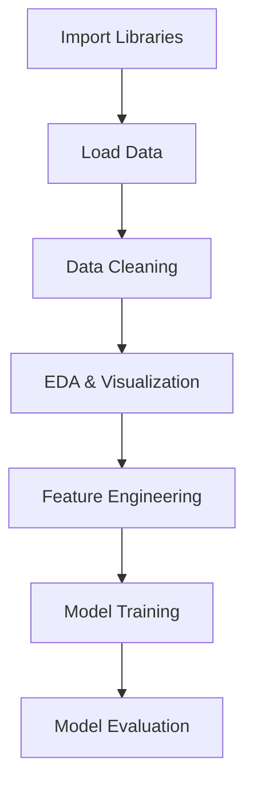
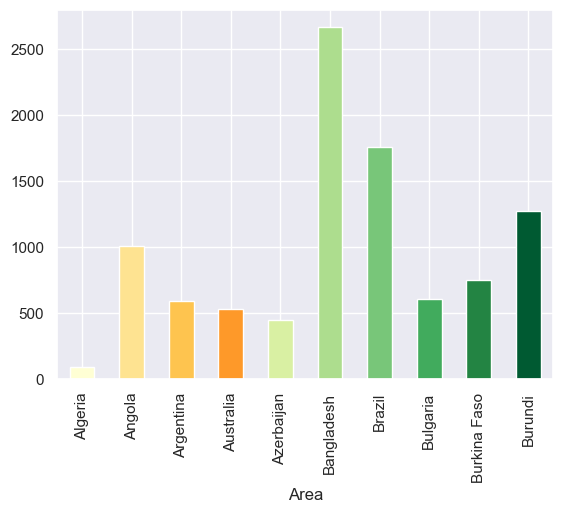
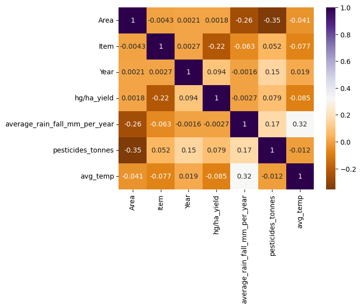
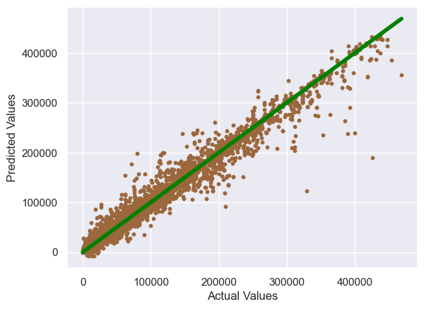
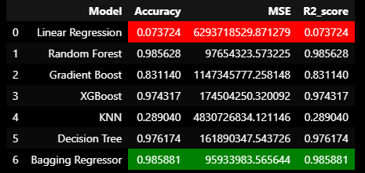

# 🌾 Crop Yield Prediction Using Machine Learning Algorithms

Welcome! This project leverages data science and machine learning to analyze and predict crop yields based on environmental, geographical, and agricultural data. The goal is to empower farmers and stakeholders with actionable insights for better crop productivity and sustainability.

---

## 🚀 Table of Contents

- [Project Overview](#project-overview)
- [Interactive Notebook](#interactive-notebook)
- [Key Features](#key-features)
- [Data Pipeline](#data-pipeline)
- [How to Run](#how-to-run)
- [Requirements](#requirements)
- [Sample Visualizations](#sample-visualizations)
- [Contributing](#contributing)
- [License](#license)

---

## 📁 Project Overview

- **Goal:** Predict the yield of various crops using multiple influencing factors.
- **Dataset:** Contains crop yield, weather, geography, and other variables ([data/yield_df.csv](data/yield_df.csv)).
- **Tech Stack:** Python, Pandas, Numpy, Matplotlib, Seaborn, GeoPandas, Plotly, Scikit-learn, Jupyter Notebook.

---

## 📓 Interactive Notebook

The main analysis, visualizations, and modeling are in [`notebook.ipynb`](notebook.ipynb).  
Open it in Jupyter or VS Code to explore step-by-step:

- Data loading and cleaning
- Exploratory Data Analysis (EDA)
- Geospatial and statistical visualizations
- Feature engineering
- Predictive modeling and evaluation

---

## 🧪 Key Features

- ✅ Data cleaning & preprocessing
- 📊 Exploratory data analysis (EDA)
- 🗺️ Geospatial data visualization
- 🌱 Crop-wise & region-wise trend analysis
- 🛠️ Feature engineering & correlation analysis
- 🤖 Predictive modeling (Linear Regression, Random Forest, XGBoost, etc.)
- 📈 Model evaluation & comparison

---

## 🔄 Data Pipeline



---

## ▶️ How to Run

1. **Clone the repository:**
    ```bash
    git clone <your-repo-url>
    cd crop-yield-prediction
    ```

2. **Install dependencies:**
    ```bash
    pip install -r requirements.txt
    ```

3. **Launch Jupyter Notebook:**
    ```bash
    jupyter notebook notebook.ipynb
    ```

4. **Explore the notebook and run cells interactively!**

---

## 🧾 Requirements

- pandas  
- numpy  
- matplotlib  
- seaborn  
- plotly  
- geopandas  
- scikit-learn  
- xgboost  
- nbformat
- notebook

*Install all with:*
```bash
pip install pandas numpy matplotlib seaborn plotly geopandas scikit-learn xgboost nbformat notebook
```

---

## 📊 Sample Visualizations

Here are some of the insights you’ll find in the notebook:

- Correlation heatmaps
- Crop yield trends by year and region
- Geospatial yield maps
- Feature importance plots
- Model performance comparisons






---

## 🤝 Contributing

Contributions are welcome! Please open issues or submit pull requests for improvements.

---

## 📜 License

This project is licensed under the MIT License.

---

*Happy analyzing and predicting!*